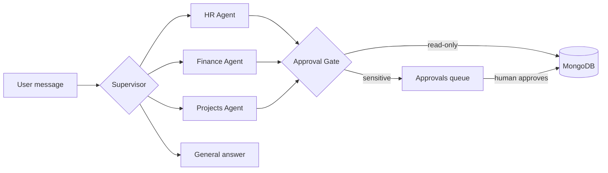

# Synapse — Multi-Module ERP Agent

**Just say it, and it's done.** Synapse is an AI assistant for company operations. Type a request like *"Approve Ali's leave"* or *"Show unpaid invoices"*, and a supervisor agent routes it to the right HR, Finance or Projects agent. The agent uses tools to read or change real data, and **sensitive actions stop for human approval** before anything happens.

  -f59e0b) 

## Screenshots

| Dashboard | Agent Chat | Approvals |
|---|---|---|
|  |  |  |

> Add your own screenshots to `docs/screenshots/` using the file names above.

## Why this project

ERP tools spread daily work across many screens, and giving an AI the power to act raises trust questions. Synapse shows a practical answer:

- **One conversation for many modules.** HR, Finance and Projects are handled from a single chat box.
- **Agents that act, not just answer.** Tool calling reads and updates the database.
- **Humans stay in control.** Leave approvals, payments and project reassignments wait for a person to approve.
- **Everything is traceable.** Agent Trace shows the route, tool calls and status of every request.

## Features

- Supervisor agent that routes each request to HR, Finance or Projects (LangGraph state graph)
- Tool calling with read-only tools and sensitive tools that go through an approval gate
- Approval queue with risk levels (Low, Medium, High) and full history
- Per-user permissions: switch sign-off for leaves or payments on or off in Settings
- Pages: Login/Sign up, Dashboard, Agent Chat, Approvals, HR, Finance, Projects, Agent Trace, Settings
- Secure auth with JWT and bcrypt
- Fully responsive: slide-out menu on phones and tablets, sidebar on desktop, light and dark themes
- Runs entirely on free tiers

## Architecture



## Tech stack

| Layer | Technology |
|---|---|
| Frontend | React 19, React Router, Vite, plain CSS |
| Backend | Node.js, Express 5, Mongoose |
| Agents | LangGraph.js, LangChain (Groq chat model), Zod tool schemas |
| LLM | Groq API (free tier), default model `openai/gpt-oss-120b` |
| Database | MongoDB (Atlas M0 free tier or local) |
| Auth | JWT, bcryptjs |

## Getting started

### Prerequisites
- Node.js 20 or newer
- A free [Groq API key](https://console.groq.com/keys)
- MongoDB: local install, or a free [Atlas M0](https://www.mongodb.com/atlas) cluster

### Install and run
```bash
git clone <your-repo-url>
cd synapse-erp-agent

npm install                # root helper (concurrently)
npm run install:all        # server + client dependencies

# create your env files (Windows PowerShell: use "copy" instead of "cp")
cp server/.env.example server/.env
cp client/.env.example client/.env

npm run dev                # API on :5000, web app on :5173
```

Open <http://localhost:5173>, create an account, sign in, and open **Agent Chat**. Demo data (employees, leaves, invoices, projects) is created automatically on first start. Reset it any time with `npm run seed`.

### Environment variables

**`server/.env`**

| Variable | Description |
|---|---|
| `MONGODB_URI` | MongoDB connection string |
| `GROQ_API_KEY` | Your Groq API key |
| `GROQ_MODEL` | Groq model name. Default `openai/gpt-oss-120b`. Groq retires models regularly, so check the [current list](https://console.groq.com/docs/models) if you see a "model does not exist" error |
| `JWT_SECRET` | Long random string. Generate one: `node -e "console.log(require('crypto').randomBytes(64).toString('hex'))"` |
| `PORT` | API port (default `5000`) |
| `CLIENT_URL` | Allowed frontend origin(s), comma-separated |

**`client/.env`**

| Variable | Description |
|---|---|
| `VITE_API_URL` | Backend URL, e.g. `http://localhost:5000/api` |

> Keep secrets in `.env` only. Never commit them or paste them in chats. `.gitignore` already excludes `.env`.

## Try it

| Say this | What happens |
|---|---|
| `Show unpaid invoices` | Finance agent calls a read-only tool and summarizes the result |
| `Approve Ali's leave` | HR agent prepares the action and an **Approval required** card appears |
| `Pay invoice INV-2041` | High-risk approval |
| `Which projects are at risk?` | Projects agent lists high-risk projects |
| `Reassign Website Revamp to Sara Khan` | Approval is always required |

## Project structure

```
synapse-erp-agent/
├── server/src/
│   ├── agent.js      # LangGraph graph: supervisor, specialist agents, approval gate
│   ├── tools.js      # All agent tools (add a tool here and agents can use it)
│   ├── api.js        # REST API and auth middleware
│   ├── models.js     # Mongoose models
│   ├── seed.js       # Demo data
│   └── index.js      # Server entry
└── client/src/
    ├── App.jsx       # Routing, sidebar and mobile drawer
    ├── ui.jsx        # Shared components and hooks
    └── pages/        # Login, Chat, Dashboard, Approvals, HR, Finance, Projects, Trace, Settings
```

## API overview

All routes are under `/api`. Everything except `/auth/register` and `/auth/login` needs `Authorization: Bearer <token>`.

| Method | Route | Purpose |
|---|---|---|
| POST | `/auth/register`, `/auth/login` | Create account, sign in |
| GET | `/auth/me` | Current user |
| PUT | `/settings` | Update agent permissions |
| POST | `/agent/chat` | Send a message to the agent |
| GET | `/runs` | Recent agent runs (Agent Trace) |
| GET | `/approvals` | List approval requests |
| POST | `/approvals/:id/decide` | Approve or reject (`{ "decision": "approve" \| "reject" }`) |
| GET | `/dashboard`, `/hr`, `/finance`, `/projects` | Page data |
| POST | `/leaves/:id/decide` | Approve or reject a leave from the HR page |

## Deployment (free)

1. **Database:** create a MongoDB Atlas M0 cluster. Under Network Access, allow your host (for Render, allow `0.0.0.0/0`).
2. **API on Render:** new Web Service, root directory `server`, build `npm install`, start `npm start`. Add the variables from `server/.env.example` and set `CLIENT_URL` to your frontend URL.
3. **Frontend on Vercel or Netlify:** root directory `client`, build `npm run build`, output `dist`. Set `VITE_API_URL` to `https://<your-api>.onrender.com/api`. The included `vercel.json` and `public/_redirects` handle page refreshes.

Render's free tier sleeps when idle, so the first request can take about 30 seconds.

## Troubleshooting

| Problem | Fix |
|---|---|
| "The model does not exist" | Update `GROQ_MODEL` in `server/.env` to a current model and restart the server |
| "Groq API key is missing or invalid" | Check `GROQ_API_KEY` in `server/.env` |
| "Cannot reach the server" | Start the backend and check `VITE_API_URL` |
| MongoDB connection fails | Check `MONGODB_URI` and the Atlas Network Access list |
| Env changes have no effect | Restart the server, since `.env` loads only at startup |
| Agent doesn't create an approval card | Use full names, for example `Approve Ali Raza's leave` |

## Limitations

This is a portfolio-grade demo. It uses one shared demo dataset, a single user role, and no automated tests yet.

## Roadmap

- User roles (admin, manager, employee) and role-based approvals
- Multi-company workspaces
- Streaming agent responses
- More tools: payroll summary, email reminders, expense reports
- Automated tests and CI

## Author

**Akhtar Ali** — Full Stack MERN + Agentic AI Developer
[GitHub](https://github.com/AkhtarAli945) · [LinkedIn](https://www.linkedin.com/in/akhtarali-mern)